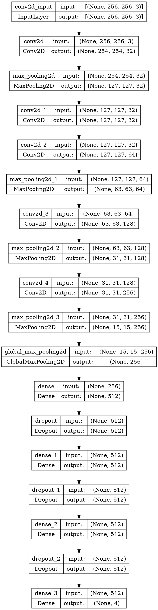

# Cat Breed Predictor ([app](https://catbreedpredictor.streamlit.app/))

## About the project
  This project uses **CNN** model to predict breed of cat. The model was trained to predict a cat's breed among 4 classes *(Bengal, Bombay, Himalayan and Persian breeds)*.

## Dataset
Dataset was collected from **Kaggle** and **Google Images** (via chrome extension). Some manual cleaning was also done. Augmentation was done to increase the dataset size from **5k** images to **100k** images.

## Tools
+ Numpy
+ Matplotlib
+ Tensorflow
+ OpenCV
+ Streamlit (for deployment)
+ Albumentations (for data augmentation)

## Model Architecture
+ Below Architecture uses **4 convolution + max-pooling blocks** followed by **global max-pooling** layer and **2 dense layers**.
+ **Output** layer is a **softmax** layer outputting the class probabilities.

## Performance
+ The model was trained for **40 epochs**, and **keras callback** was added to **save** the best model (around 37th or 38th epoch).
+ Below are the training plots -

## Result
  The model achieved a **Precision** of **0.9966528**, **Recall** of **0.9996526**, **F1 Score** of **0.9981505** and an **Accuracy** of **0.9857292** on the **test** set.

## Working

.png)
.png)

## Running in local environment
+ clone this repo in local machine.
+ create and switch to virtual environment.
+ install the dependencies from `requirements.txt`.
+ in the terminal, type `streamlit run app.py`.

## References
+ [Tensorflow](https://www.tensorflow.org/api_docs/python/tf)
+ [Streamlit](https://docs.streamlit.io/)
+ [Image augmentation via Albumentations](https://albumentations.ai/docs/getting_started/image_augmentation/)
<!-- ## Future improvements to do
_This repo is open to contributions_ 😊
+ Adding a **cat vs non-cat classifier** before **cat breed classifier** model, to **avoid** prediction on non-cat uploaded images.
+ ~~Training the base (cat breed classifier) model on a better and cleaner data, and increasing the classes.~~ (Done) -->
